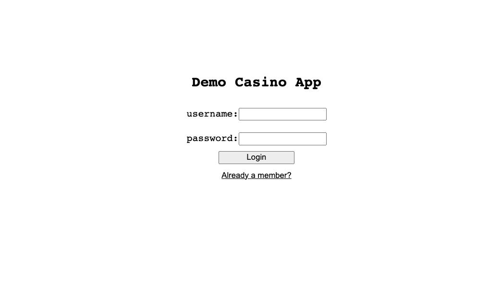

# casio-mern-app

# Project motivations 
I wanted to try this project to continue building off the skills I have learned while exploring web development. I intend to use this project as a test application when running kubernetes, and container technologies from azure and AWS.

The motivation behind this project came from reading a reddit post. This post talked about doing a software engineering interview where this individual was asked to create a full stack casino application that allowed users to authenticate, deposit/withdraw from their accounts, and play the games.

# Application features

- /api/v1/auth -> user can register and login to their account
- /api/v1/transaction -> user can deposit, withdrawl, and check their transaction history
- /api/v1/games -> list all games, play a single game, create a game 

# Architecture / Tech Stack 

I plan on hosting this application on Azure app services for the frontend, and the backend will be on Azure container apps.

Tech stack: 
- Azure container apps 
- Github Actions 
- CosmosDB
- Terraform 


# Information on Azure container apps

### Networking 
Container apps run in the context of an environment (Container apps environment). By default your app environment is going to create a virutal network that is managed by microsofts tenant, so it's inaccessible. 

By leveraging the custom vnet option, you get the following features:
- app gateway integration 
- network security groups
- communicating with private endpoint enabled resources 

Private vs Public:
- external: environment is deployed as an external resource, routable by the internet, and publicly exposed 
- internal: environment has no public endpoint, the endpoint is mapped to an internal azure load balancer IP address

Custom vnet considerations 
- provide a dedicated subnet to azure container apps 
- subnet range is assigned from the azure container environment

Ingress configuration
- Accessibility level:
    - sets whether your app is public or private 
    - env variable (CONTAINER_APP_ENV_DNS_SUFFIX) used for resolving FQDN suffix for the environment, apps communicating within the same environment are able to use the app name 
- Traffic split rules: 
    - allows you to split the traffic between multiple revisions of your application


### DNS 

resolving internal DNS names 
- custom domains: 
    - create an azure private DNS zone that resolves the apex domain to the static IP address of the container apps environment

NOTE: you can find the static IP address of the container apps environment with the following command 
``` az containerapp env list ```

The nginx configuration is what facilitates the communication between the frontend and the backend. the package.json uses the "proxy" option when developing locally, so when we are writing code, we only specify the path for the API request. ex: 

```
const fetch = async () => { 
    try { 
        const fetchRequest = await fetch("/api/v1/auth/register", options)
    } catch(error) { 
        console.log(error)
    }
}
```

##  the local dev environment 

to run the application locally, run the following commands: 

``` docker-compose build ```

``` docker-compose up ```


# Steps to deploy on your own 

1. Deploy the underlying infrastructure 

``` cd terraform/infra ```

NOTE: you can run terraform init, if you want to review what you are deploying first 

``` terraform init && terraform apply -auto-approve ``` 

**This may take up to 10 minutes**


2. build and push the application containers 

- login to the az cli first 

``` az login ``` 

- run the build script (build.sh), the script accepts one argument 

``` ./build.sh v1.0 ``` 


3. deploy the application 

``` cd terraform/app ``` 

The following variables will need to be inputted to the variables.tf file located in the terraform/app directory.
- backend-tag: you supply this value to the build script (ex: v1.0)

- frontend-tag: you supply this value to the build script (ex: v1.0)

- acr-password: run the following az cli command to get this value 

``` az acr credential show -n casinomernregistry ```

- cors_domain: this value will be supplied as an output when the infrastructure deployment is completed

- db_password: run the following AZ cli command to get this value 

``` az cosmosdb keys list --name casino-db --resource-group casino-mern-app ``` 


4. visit the application 

run the following command to find the fqdn 

``` az containerapp show --name casino-frontend --resource-group casino-mern-app | jq .properties.latestRevisionFqdn ``` 

put the FQDN in a browser with https:// in front

if done correctly, you should be able to see the following image

